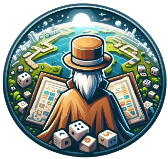

# UriGames

## [See the App!](https://urigames.netlify.app)

## Descripción

**NOTA -** UriGames es una base de datos de juegos de mesa donde puedes almacenar tus propios juegos.
#### [Repositorio del Clientee](https://github.com/RoigOriol/Urigames-client.git)
#### [Repositorio del Servidor](https://github.com/RoigOriol/Urigames-server.git)

## Tecnologías y librerías 

**NOTA -** Lista aquí todas las tecnologías utilizadas en el proyecto como HTML, CSS, Javascript, React, axios, Bootstrap y React-Bootstrap
**Tecnologías**
- HTML
- CSS
- Javascript
- React
- React-router-dom
- Node

**Librerías**
- React Bootstrap

# Client Structure

## Acciones del usuario
Todas las acciones que un usuario puede realizar en la aplicación:

- **404** - Página de Not Found.
- **500** - Página de error.
- **homepage** - Página principal de la app.
- **abaoutpage** - Página con infromación del creador de la página.
- **useerprofile** - Página de perfil de un usuario.
- **gamelist** - Página donde se muestran todos los juegos almacenados en la DB.
- **gamedetails** - Página donde se muestran los detalles de cada juego.
- **loginpage** - Página de logeo.
- **signuppage** - Página de registro.
- **gameeditionpage** - Página de edición de un juego.
- **gamecreationpage** - Página de creación de un juego.

## Rutas del Cliente

## React Router Routes (React App)

| Path                      | Page            | Components        | Permissions              | Behavior                                                      |
| ------------------------- | ----------------| ----------------  | ------------------------ | ------------------------------------------------------------  |
| `/`                       | Home            |                   | public                   | Home page                                                     |
| `/signup`                 | Signup          |                   | anon only `<IsAnon>`     | Signup form, link to login, navigate to homepage after signup |
| `/login`                  | Login           |                   | anon only `<IsAnon>`     | Login form, link to signup, navigate to homepage after login  |
| `/profile`                | Profile         | EditProfile       | user only `<IsPrivate>`  | Navigate to homepage after logout, expire session             |
| `/games/list`             | GameList        | AddGame, GameCard | user only `<IsPrivate>`  | Shows all films on backlog                                    |
| `/games/edit`             | GamesEdit       |                   | user only `<IsPrivate>`  | Shows all games on backlog                                    |
| `/games/favourites`       | FavouriteList   | GameCard          | user only `<IsPrivate>`  | Shows all games on backlog                                    |

  <Route path="/" element={<Home />} />
        <Route path="/login" element={<Login />} />
        <Route path="/signup" element={<Signup />} />
        <Route path="*" element={<NotFoundPage />} />
        <Route path="/error" element={<ErrorPage />} />
        <Route path="/about" element={<AboutPage />} />
        <Route path="/not-found" element={<NotFoundPage />} />
        <Route path="/collaborators" element={<Collaborators />
            
          }/>
        <Route
          path="/games"
          element={
            <OnlyPrivate>
              <GameList />
            </OnlyPrivate>
          }
        />
        <Route
          path="/games/:id"
          element={
            <OnlyPrivate>
              <GameDetails />
            </OnlyPrivate>
          }
        />
        <Route
          path="/games/create"
          element={
            <AdminPrivate>
              <GameCreation />
            </AdminPrivate>
          }
        />
        <Route
          path="/games/:id/edit"
          element={
            <AdminPrivate>
              <GameEdition />
            </AdminPrivate>
          }
        />
        <Route
          path="/user/:id"
          element={
            <OnlyPrivate>
              <UserProfile />
            </OnlyPrivate>

## Other Components

- MyNavbar
- Footer
- Comment
- CommentItem
- Footer
- FormComments
- OnlyPrivate
  
  ## Services

- Auth Service
  - auth.login(user)
  - auth.signup(user)
  - auth.verify()

- Backlog Service
  - game.filter(type, status)
  - game.detail(id)
  - game.add(id)
  - game.delete(id)
  - game.update(id)
  
- External API
  - gameApi.details
  - gameApi.list
  
## Context

- auth.context
- theme.context
## Links

### Creador

[Oriol Roig](https://github.com/RoigOriol)

### Project

[Repository Link Client](https://github.com/RoigOriol/Urigames-client.git)

[Repository Link Server](https://github.com/RoigOriol/Urigames-server.git)

[Deploy Link](https://urigames.netlify.app)

### Slides

[Slides Link]()